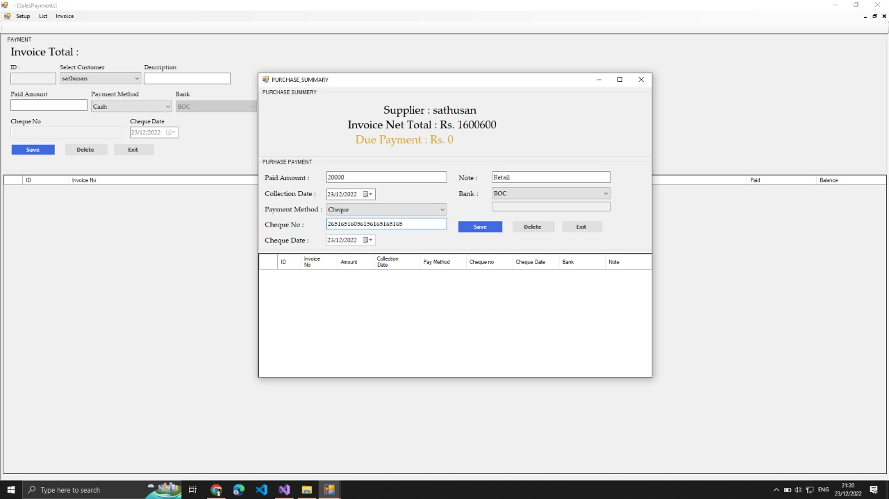

# Jewellery-Poss-For-Code-Idea :wave:	
- This system is done using the **C# and MySQL**(store procture) is used as the database.
- It is a system developed to record the 
- accounts,
- users,
- inovices,
- purchase,
- bank,
- cheque Details and More details of a **Jeweller shop**
- 
- :point_down:	:point_down:	:point_down:	:point_down:	:point_down:	:point_down:	:point_down:	:point_down:	:point_down:	:point_down:	:point_down:	

